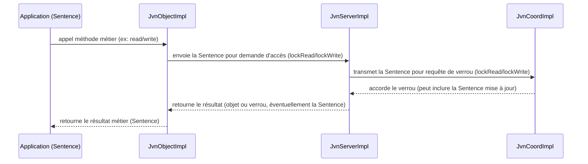

# Notes sur les points à revoir ou à confirmer

## Ajout de transient sur le localServer

Dans la classe JvnObjectImpl, l'attribut localServer est marqué comme transient. Cela signifie qu'il ne sera pas sérialisé lorsque l'objet JvnObjectImpl sera sérialisé. Il est important de vérifier que cela est intentionnel et que le comportement attendu est bien celui-ci. Si localServer doit être recréé ou réinitialisé après la désérialisation, il faut s'assurer que cela est bien géré dans le code.

À voir dans ce [fichier](./src/jvn/impl/JvnObjectImpl.java)

## Schema des interactions

