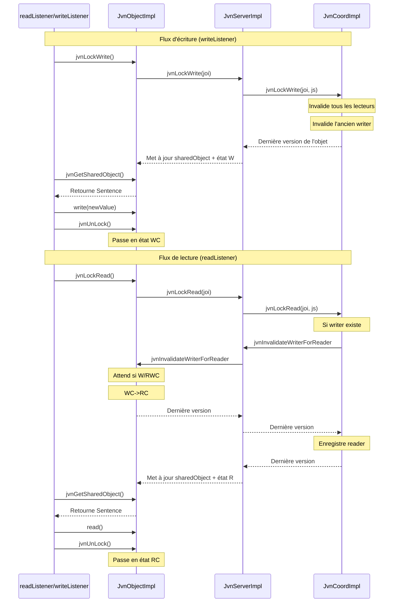

# Notes sur les points à revoir ou à confirmer

## Pour la présentation

- Préparer une démonstration simple avec deux clients (un lecteur et un écrivain) pour montrer le fonctionnement du système.
- Préparer des slides pour expliquer l'architecture et les interactions entre les composants
- Préparer un exemple de deux locks en mêmes temps (un read et un write) pour montrer la gestion des conflits

## Ajout de transient sur le localServer

Dans la classe JvnObjectImpl, l'attribut localServer est marqué comme transient. Cela signifie qu'il ne sera pas sérialisé lorsque l'objet JvnObjectImpl sera sérialisé. Il est important de vérifier que cela est intentionnel et que le comportement attendu est bien celui-ci. Si localServer doit être recréé ou réinitialisé après la désérialisation, il faut s'assurer que cela est bien géré dans le code.

À voir dans ce [fichier](./src/jvn/impl/JvnObjectImpl.java)

## Schema des interactions



## Exécution du Stress Test

Le stress test permet de vérifier la cohérence du système JVN avec plusieurs processus concurrents effectuant des opérations aléatoires de lecture/écriture.

### Prérequis
1. Compiler le projet (les fichiers `.class` doivent être dans `out/production/JVN_Project`)
2. Le coordinateur JVN doit être démarré

### Démarrage du coordinateur
Dans un terminal :
```bash
cd out/production/JVN_Project
java jvn.impl.JvnCoordImpl
```

### Lancement du stress test
Le stress test doit être lancé **2 fois (ou plus) en parallèle** dans des terminaux différents pour simuler plusieurs machines concurrentes.

**Terminal 1 :**
```bash
cd out/production/JVN_Project
java jvn.test.StressTest
```

**Terminal 2 :**
```bash
cd out/production/JVN_Project
java jvn.test.StressTest
```

**Terminal 3 (optionnel) :**
```bash
cd out/production/JVN_Project
java jvn.test.StressTest
```

### Fonctionnement
- Chaque processus effectue **20 itérations**
- À chaque itération : choix aléatoire entre **READ** ou **WRITE**
- Délai aléatoire entre **0 et 500ms** entre chaque opération
- Le premier processus à démarrer crée l'objet "COUNTER" avec la valeur initiale 0
- Les suivants récupèrent l'objet existant via `jvnLookupObject()`

### Validation de la cohérence
Observez les logs des différents terminaux :
- Les valeurs doivent s'incrémenter de manière cohérente (pas de valeurs écrasées)
- À la fin, la **valeur finale** affichée par chaque processus doit être identique
- Cette valeur doit correspondre au **nombre total de WRITE** effectués par tous les processus

### Exemple de sortie attendue
```
[PID:12345][Iter  1] WRITE : 0 → 1 (délai: 234ms)
[PID:12345][Iter  2] READ  : 1 (délai: 156ms)
[PID:12345][Iter  3] WRITE : 1 → 2 (délai: 423ms)
...
✓ Process 12345 terminé
  Durée totale  : 5432ms
  READs         : 12
  WRITEs        : 8
  Valeur finale : 23
```


```

